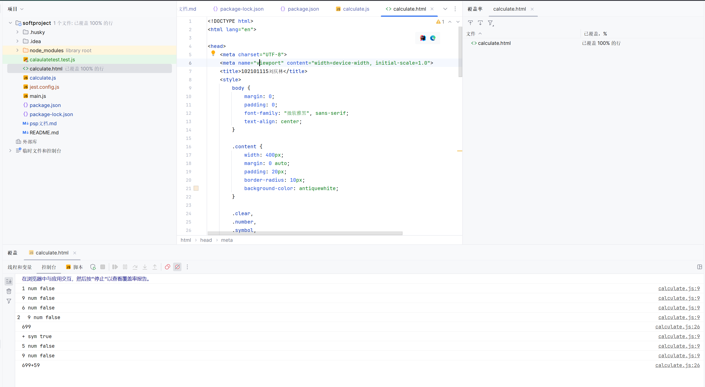

[toc]

作业基本信息

## Gitcode项目地址	
https://github.com/liuqinglinnn/softproject.git

## PSP表格

| 这个作业属于哪个课程 | 软件工程林啟锋班级                                    |
| :------------------- | :---------------------------------------------------- |
| 这个作业要求在哪里   | https://bbs.csdn.net/topics/617294583                 |
| 这个作业的目标       | 实现一个具有基本科学计算功能的计算器，并以exe格式打包 |
| 其他参考文献         | https://developer.mozilla.org/zh-CN/docs/Web/HTML     |

|                                         |                                         |                  |                  |
| :-------------------------------------- | :-------------------------------------- | :--------------- | :--------------- |
| PSP                                     | Personal Software Process Stages        | 预估耗时（分钟） | 实际耗时（分钟） |
| Planning                                | 计划                                    | 10               | 10               |
| • Estimate                              | • 估计这个任务需要多少时间              | 10               | 10               |
| Development                             | 开发                                    | 140              | 150              |
| • Analysis                              | • 需求分析 (包括学习新技术）            | 10               | 10               |
| • Design Spec                           | • 生成设计文档                          | 30               | 30               |
| • Design Review                         | • 设计复审                              | 10               | 10               |
| • Coding Standard                       | • 代码规范 (为目前的开发制定合适的规范) | 10               | 10               |
| • Design                                | • 具体设计                              | 10               | 10               |
| • Coding                                | • 具体编码                              | 30               | 40               |
| • Code Review                           | • 代码复审                              | 20               | 20               |
| • Test                                  | • 测试（自我测试，修改代码，提交修改）  | 20               | 20               |
| Reporting                               | 报告                                    | 30               | 40               |
| • Test Repor                            | • 测试报告                              | 10               | 20               |
| • Size Measurement                      | • 计算工作量                            | 10               | 10               |
| • Postmortem & Process Improvement Plan | • 事后总结, 并提出过程改进计划          | 10               | 10               |
|                                         | 合计                                    | 180              | 200              |

## 解题思路描述

利用html+css+js实现计算器，用打包工具变成exe，利用测试框架进行测试

### 问题1实现基本计算功能

利用 js的库函数eval

实现方式

```
 resultField.value = eval(resultField.value);
```

### 问题2小数计算存在精度问题

利用math函数转换

实现方式

```
//保留n位小数
		function roundFun(value, n) {
			return Math.round(value * Math.pow(10, n)) / Math.pow(10, n);
		}
```


### 问题3html，css页面样式

利用input作为计算器输入，result的id绑定数据

实现方式

```
	<input type="button" value="C" class="clear" onclick="clearValue()" />
		<input type="text" id="result" readonly="readonly" placeholder="运算结果显示" />
		<br />
		<input type="button" value="1" class="number" onclick="get(this.value,'num')" />
		<input type="button" value="2" class="number" onclick="get(this.value,'num')" />
		<input type="button" value="3" class="number" onclick="get(this.value,'num')" />
		<input type="button" value="+" class="symbol" onclick="get(this.value,'sym')" />
		<br />
```


### 问题4连续计算时，输入数字重置之前结果，输入符号继续计算

 采用type字段判断计算后的传入的是数字还是运算符号

实现方式

```
let end = false
		function clearValue() {
			resultField.value = "";
			end = false
		}

		function get(value, type) {
			console.log(value, type, end);
			if (end == true && type != "num")
			{
				resultField.value += value;
				end = false;
			}
			else if(end == true && type == "num")
			{
				this.clearValue()
				resultField.value += value;
			}
			else {
				resultField.value += value;
			}

		}
```

### 问题5科学计算器的实现

利用js的库函数实现函数计算

```
		function sqrt() {
			end = true
			resultField.value = Math.sqrt(resultField.value);
		}
```

### 问题6撤回输入

字符串长度-1

实现方式

```
function back() {resultField.value = resultField.value.substring(0, resultField.value.length - 1);}
```

### 问题7打包成exe

利用electron插件，配合npm包管理工具，实现html页面打包。参考了官方文档，对package.json脚本编写，实现了打包操作。

关键代码

package.json

```
{
    "name": "electronapp",
    "version": "1.0.0",
    "description": "to calculate",
    "main": "main.js",
    "scripts": {
        "test": "jest",
        "start": "electron .",
        "package-win": "electron-packager Calculate --platform=win32 --electron-version=10.0.0 --arch=x64 --download.mirrorOptions.mirror=https://npm.taobao.org/mirrors/electron/ --asar --app-version=0.0.0 --build-version=0.0.0 --out=Calculate --overwrite --no-package-manager  "
    },
    "devDependencies": {
        "electron": "^26.2.2",
        "electron-packager": "^17.1.2"
    },
    "author": "lql",
    "license": "ISC"
}
```
```
npm install --save-dev @electron-forge/cli
npx electron-forge import

✔ Checking your system
✔ Initializing Git Repository
✔ Writing modified package.json file
✔ Installing dependencies
✔ Writing modified package.json file
✔ Fixing .gitignore

We have ATTEMPTED to convert your app to be in a format that electron-forge understands.

Thanks for using "electron-forge"!!!
```


## 接口设计和实现过程

 计算器无需后端接口。实现过程在问题中以代码形式贴出

## 关键代码展示

 

```
<script>
		let resultField = document.getElementById("result");
		let end = false
		function clearValue() {
			resultField.value = "";
			end = false
		}

		function get(value, type) {
			console.log(value, type, end);
			// if (end == true) {
			// 	resultField.value += value;

			// }
			if (end == true && type == "num") {
				this.clearValue()
				resultField.value += value;
			}
			else {
				end = false;
				resultField.value += value;
			}
		}
		function calculate() {
			end = true
			try {
				console.log(resultField.value);
				if (resultField.value.indexOf('^') != -1) {
					resultField.value = this.pow(resultField.value, resultField.value.indexOf('^'))
				}
				resultField.value = eval(resultField.value);
				//
				//计算存在精度问题s
				resultField.value = roundFun(resultField.value, 5)

			} catch (error) {
				resultField.value = "错误";
			}
		}

		function pow(value, pos) {
			if (pos != -1) {
				let arr = value.split("")
				let powVal = Math.pow(arr[pos - 1], arr[pos + 1])
				arr.splice(pos - 1, 3, powVal)
				value = arr.join("")
				return value
			}
		}
		function back() {
			resultField.value = resultField.value.substring(0, resultField.value.length - 1);

		}
		function sin() {
			end = true
			resultField.value = Math.sin(resultField.value);
			console.log(resultField.value);
			if (resultField.value == "NaN")
				resultField.value = "运算错误";

		}
		function cos() {
			end = true
			resultField.value = Math.cos(resultField.value);
			if (resultField.value == "NaN")
				resultField.value = "运算错误";
		}
		function tan() {
			end = true
			resultField.value = Math.tan(resultField.value);
			if (resultField.value == "NaN")
				resultField.value = "运算错误";
		}
		function sqrt() {
			end = true
			resultField.value = Math.sqrt(resultField.value);
			if (resultField.value == "NaN")
				resultField.value = "运算错误";
		}
		function cbrt() {
			end = true
			resultField.value = Math.cbrt(resultField.value)
			if (resultField.value == "NaN")
				resultField.value = "运算错误";
		}
		function square() {
			end = true
			resultField.value = Math.pow(resultField.value, 2);
		}

		function cube() {
			end = true
			resultField.value = Math.pow(resultField.value, 3);
		}

		function cal(value) {
			resultField.value += value;
		}

		//保留n位小数
		function roundFun(value, n) {
			return Math.round(value * Math.pow(10, n)) / Math.pow(10, n);
		}
	</script>
```


## 性能改进
前端函数部分基本都是调用js的math库，基本为最优执行方案
## 单元测试
前端单元测试，我确实找不到一个很好的方案，尝试过了jest插件，但是实现过程中，js函数需要对dom进行操作，测试类编写实在超过我的能力范围
只能用idea自带的调试器配合前端log日志，对代码覆盖率进行检测


## 异常处理

 1连续输入两个运算符，视为错误

```
 if (resultField.value == "NaN")

     resultField.value = "运算错误";
```

2计算时报错

```
		function calculate() {
			end = true
			try {
				console.log(resultField.value);
				if (resultField.value.indexOf('^') != -1) {
					resultField.value = this.pow(resultField.value, resultField.value.indexOf('^'))
				}
				resultField.value = eval(resultField.value);
				//
				//计算存在精度问题s
				resultField.value = roundFun(resultField.value, 5)

			} catch (error) {
				resultField.value = "错误";
			}
		}
```

 

## 心得体会

 利用前端三件套实现了一个计算器的简易功能，对前端有了更加深入的了解。同时使用了npm包管理相关工具对计算器进行了打包操作，使文件能够在windows上运行，期间查看了很多官方文档，对前端开发流程有了一个初步的认识
